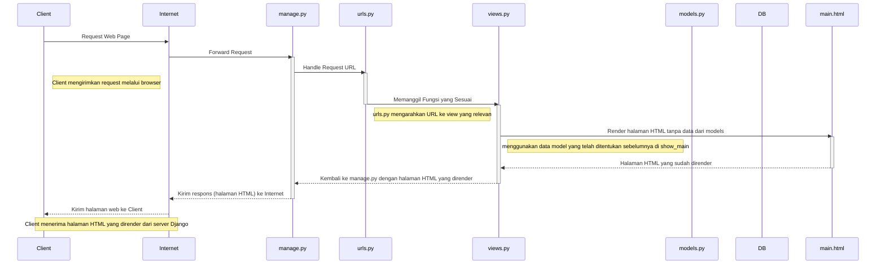
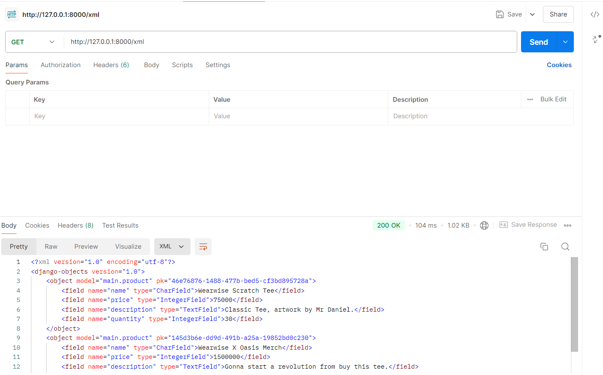
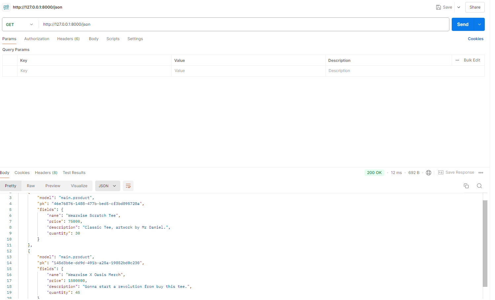
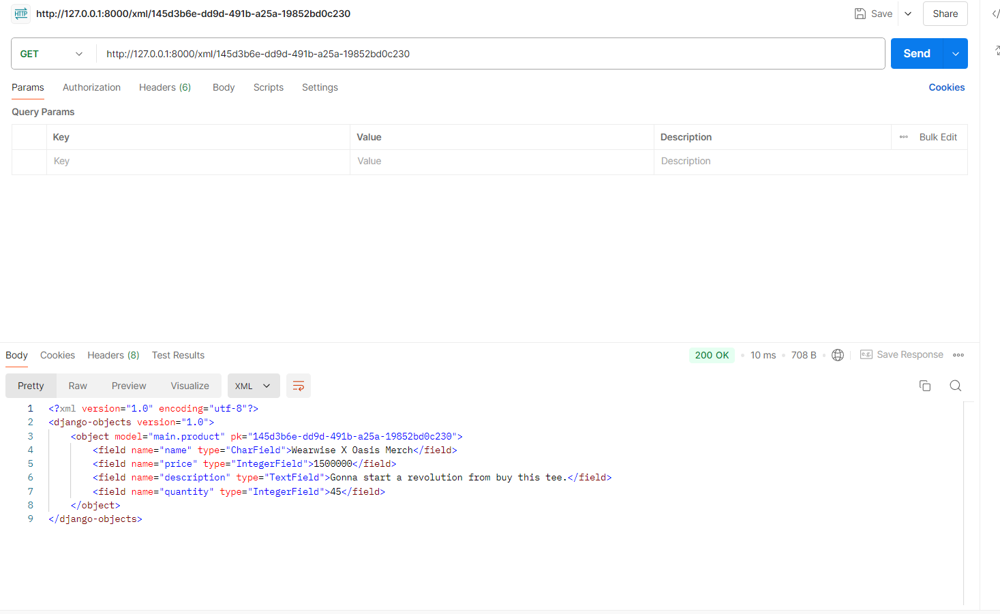

## Gilbert Kristian - 2306274951 - PBP D 

:link: [Click Me - Link Web](http://gilbert-kristian-wearwise.pbp.cs.ui.ac.id/), [Click Me - Tugas 2](#:nerd_face:Tugas--2), [Click Me - Tugas 3](#:cold_face:Tugas--3 )

## :nerd_face:Tugas—2
 - Jelaskan bagaimana cara kamu mengimplementasikan checklist di atas secara step-by-step (bukan hanya sekadar mengikuti tutorial).
    
    JAWAB : 
    
    Langkah-langkah yang saya lakukan dalam implementasi checklist adalah sebagai berikut:
    
1. Membuat sebuah repository lokal dengan nama project "Wearwise"

2. Menjalankan "django-admin startproject wear_wise ." untuk memulai project

3. Menambahkan "localhost", "127.0.0.1" ke dalam list ALLOWED_HOSTS di file settings.py untuk keperluan deployment

   ```python
   ALLOWED_HOSTS = ["localhost", "127.0.0.1", ]
   ``` 
4. Membuat aplikasi baru dengan nama main dengan menjalankan command "python manage.py startapp main"

5. Mendaftarkan 'main' ke dalam INSTALLED_APPS di settings.py pada direktori wear_wise
   ```python
   INSTALLED_APPS = [
   'django.contrib.admin',
   'django.contrib.auth',
   'django.contrib.contenttypes',
   'django.contrib.sessions',
   'django.contrib.messages',
   'django.contrib.staticfiles',
   'main'
   ]
   ``` 
6. Membuat direktori baru di dalam direktori main bernama templates untuk membuat main.html

7. Membuat model pada aplikasi main dengan nama product yang memiliki atribut name, price, description, dan quantity.

   ```python
   from django.db import models

   class Product(models.Model):
   name = models.CharField(max_length=100)
   price = models.IntegerField()
   description = models.TextField()
   quantity = models.IntegerField(default=0)

   @property
   def __str__(self):
      return self.name
   ``` 
8. Membuat migrasi model dengan menjalankan "python manage.py makemigrations" & "python manage.py migrate" untuk menyesuaikan struktur tabel database 
berdasarkan perubahan model yang telah ditentukan dalam kode.

9. Menghubungkan views.py pada direktori main dengan template, fungsi show_main akan mengatur permintaan HTTP dan mengembalikan nama aplikasi, nama, dan kelas.

10. Membuat _routing_ dengan membuat file urls.py di aplikasi main untuk memetakan fungsi yang telah dibuat di views.py 
dengan membuat urlpatterns = [path('', show_main, name='show_main'),]
      ```python
      from django.urls import path
      from main.views import show_main

      app_name = 'main'

      urlpatterns = [
         path('', show_main, name='show_main'),
      ]
      ```

11. Membuat _routing_ di file urls.py di direktori wear_wise dengan membuat urlpatterns = [path('', include('main.urls')),] 
yang akan mengimpor rute URL dari aplikasi.
      ```python
      from django.contrib import admin
      from django.urls import path, include 

      urlpatterns = [
         path('admin/', admin.site.urls),
         path('', include('main.urls')),
      ]
      ```

12. Men-deploy ke PWS agar dapat diakses _public_, lalu meletakkan URL PWS ke ALLOWED_HOSTS di settings.py
      ```python
      ALLOWED_HOSTS = ["localhost", "127.0.0.1", "gilbert-kristian-newwearwise.pbp.cs.ui.ac.id"]
      ```

      _AFTER RE-DEPLOY_ (url ganti): 
      ```python
      ALLOWED_HOSTS = ["localhost", "127.0.0.1", "gilbert-kristian-wearwise.pbp.cs.ui.ac.id"]
      ```

 - Buatlah bagan yang berisi request client ke web aplikasi berbasis Django beserta responnya dan jelaskan pada bagan tersebut kaitan antara urls.py, views.py, models.py, dan berkas html.
    
    Jawab :



   Penjelasan alur bagan :
   1. Client meminta halaman web, kemudian permintaan ini diteruskan oleh Internet ke server Django, yaitu manage.py.
   2. manage.py menerima permintaan dan meneruskannya ke urls.py yang bertugas memetakan URL yang diminta ke fungsi yang sesuai di views.py.
   3. urls.py mengarahkan permintaan ke fungsi yang relevan di views.py; views.py dapat meminta data dari models.py jika diperlukan.
   4. views.py merender halaman HTML dengan mengisi template yang relevan (diwakili oleh main.html).
   5. main.html mengembalikan halaman yang telah dirender ke views.py yang kemudian mengirimkan hasilnya ke manage.py.
   6. manage.py mengirimkan respons halaman HTML yang dirender kembali ke Client melalui Internet yang akhirnya memungkinkan Client untuk menampilkan halaman web di browser.


- Jelaskan fungsi git dalam pengembangan perangkat lunak!
    
    Jawab : 
    
   Git dapat membantu dalam pengembangan perangkat lunak yang memungkinkan banyak pengembang untuk bekerja sama dan dapat mudah untuk melacak perubahan dalam kode. Fitur yang paling berguna dalam pengembangan perangkat lunak di git adalah branch. Dengan menyediakan mekanisme branch, Git memudahkan kolaborasi antarpengembang sehingga banyak orang dapat bekerja pada fitur yang berbeda secara bersamaan tanpa terjadi konflik. Pengembang bisa membuat branch baru untuk setiap fitur atau bug fix dan menggabungkannya setelah selesai.

   Beberapa manfaat lain git dalam pengembangan perangkat lunak:
   1. Versi Kontrol: Git membantu tim pengembang memantau perubahan kode sumber. Setiap perubahan yang dilakukan pada proyek disimpan dalam commit sehingga memungkinkan para pengembang melihat riwayat perubahan dan memulihkan versi sebelumnya jika terjadi masalah.

   2. Pemulihan Kesalahan: Git menyimpan semua aktivitas proyek sehingga mudah untuk menemukan dan memperbaiki kesalahan tanpa kehilangan pekerjaan penting dan memungkinkan pengembang untuk memutar kembali proyek ke versi sebelumnya jika terjadi bug atau kesalahan.

   3. Penyimpanan Terdistribusi: Git menggunakan pendekatan terdistribusi yang memungkinkan setiap pengembang memiliki salinan lengkap dari riwayat proyek secara keseluruhan dan juga pengembang dapat melanjutkan pekerjaan secara lokal tanpa koneksi internet, serta bisa mensinkronisasi perubahan ke server pusat kapanpun diperlukan.

   4. Integrasi Berkelanjutan (CI/CD): Git sering digunakan dengan alat integrasi berkelanjutan (CI) dan pengiriman berkelanjutan (CD) untuk menguji dan mengirimkan kode secara otomatis setiap kali perubahan di-push yang akan mempercepat siklus pengembangan dan membantu menemukan kesalahan lebih awal.

   5. Open Source : Git adalah tools open-source yang populer di banyak proyek perangkat lunak, termasuk proyek open-source besar. Platform seperti GitHub akan mempermudah pengembang dari seluruh dunia untuk berkontribusi pada proyek.

- Menurut Anda, dari semua framework yang ada, mengapa framework Django dijadikan permulaan pembelajaran pengembangan perangkat lunak?
    
    Jawab :  

    Django dijadikan permulaan pembelajaran pengembangan perangkat lunak karena pengembangannya yang bersifat open source, ridiculously fast, fully loaded, reassuringly secure, exceedingly scalable, dan incredibly versatile. Django menyediakan banyak fitur-fitur bawaan yang memudahkan pemula untuk mulai membangun aplikasi. Django juga menggunakan pola MTV yang membantu pemula lebih mudah dalam memahami struktur aplikasi, yaitu model (database), view (logika aplikasi), dan template (mengelola tampilan). Django juga menggunakan Python, yang jugdi mana merupakan bahasa pemrograman yang populer di kalangan pemula karena sintaksnya yang sederhana dan mudah dibaca. Django juga dirancang dengan mempertimbangkan praktik keamanan yang baik.

- Mengapa model pada Django disebut sebagai ORM?
    
    Jawab :

    Django disebut sebagai Object Relational Mapping karena penggunaan ORM di Django memungkinkan pengembang untuk berinteraksi dengan database menggunakan kode Python tanpa menulis SQL secara manual. Django akan mengubah objek Python (model) menjadi tabel di database. Setiap atribut model diubah menjadi kolom dalam tabel. 


## :cold_face:Tugas—3 
- Jelaskan mengapa kita memerlukan _data delivery_ dalam pengimplementasian sebuah platform?

   Jawab : 

   _Data delivery_ diperlukan apabila kita perlu mengirimkan data dari _stack_ ke _stack_ lainnya.
   Dengan _data delivery_, hal tersebut akan mendukung kualitas data, tata kelola data, dan keamanan data platform. _Data delivery_ juga akan memastikan ketersediaan, kecepatan, dan kehandalan informasi yang dibutukan oleh _user_.

-  Menurutmu, mana yang lebih baik antara XML dan JSON? Mengapa JSON lebih populer dibandingkan XML?

   Jawab : 

   JSON lebih baik daripada XML. Alasannya adalah JSON memiliki ukuran file yang lebih kecil, transmisi data yang lebih cepat, dan mudah dimengerti. XML memiliki sintaks yang lebih rumit untuk dibuat dan dibaca sehingga menghasilkan ukuran file yang lebih besar. JSON juga jauh lebih aman daripada XML.

- Jelaskan fungsi dari method is_valid() pada form Django dan mengapa kita membutuhkan method tersebut?

   Jawab : 
   
   Method is_valid() akan  melakukan validasi untuk setiap _form_. Method tersebut akan me-_return_ _True_ apabila data valid. Jika validasi gagal, is_valid() akan mengisi atribut form.errors pada objek form dengan informasi tentang kesalahan yang terjadi. 

-  Mengapa kita membutuhkan csrf_token saat membuat _form_ di Django? Apa yang dapat terjadi jika kita tidak menambahkan csrf_token pada _form_ Django? Bagaimana hal tersebut dapat dimanfaatkan oleh penyerang?

   Jawab : 

   * csrf_token adalah token yang sangat dibutuhkan karena berfungsi sebagai _security_ yang akan mencegah dari serangan _Cross-Site Request Forgery_. Serangan tersebut dilakukan oleh penyerang yang akan membuat sebuah _request_ yang tidak sah ke aplikasi web. Dengan adanya csrf_token, server dapat memverifikasi bahwa permintaan yang diterima memang datang dari pengguna yang benar-benar mengakses aplikasi web tersebut. Jika tidak sesuai, _server_ dapat menolak permintaan tersebut.

   * Jika tidak menambahkan csrf_token, penyerang bisa membahayakan _server_ web kita yang berpotensi mengakibatkan pengambilalihan penuh aplikasi web. 
   
   * Penyerang akan memanfaatkan serangan CSRF seperti memiliki akses mengubah data pengguna, melakukan tindakan yang tidak diinginkan di aplikasi web, atau memanfaatkan identitas pengguna tanpa sepengetahuan mereka. 
   
      Contohnya, misal sebuah aplikasi web yang memungkingkan pengguna mengubah identitas pengguna melalui permintaan POST. Jika web tersebut memiliki kerentanan XSS _(Cross-Site Scripting)_, penyerang dapat menyisipkan skrip jahat yang dapat membaca dan mengirimkan _cookie_ yang disimpan di _browser_ pengguna ke _server_ penyerang. Dengan akses ke _cookie_ ini, penyerang dapat mencuri ID sesi dan menggunakan _cookie_ tersebut untuk mengakses akun korban. Maka dari itu, csrf_token sangat perlu untuk mencegah hal-hal tersebut.


- Jelaskan bagaimana cara kamu mengimplementasikan _checklist_ di atas secara _step-by-step_ (bukan hanya sekadar mengikuti tutorial).

   Jawab : 
   
   1. Setelah membuat _template_ 'base.html', selanjutnya melakuan _import_ uuid di berkas models.py di pada direktori main dengan mengisi kode seperti ini:
      ```python
      from django.db import models
      import uuid
      class Product(models.Model):
         id = models.UUIDField(primary_key=True, default=uuid.uuid4, editable=False)
         name = models.CharField(max_length=100)
         price = models.IntegerField()
         description = models.TextField()
         quantity = models.IntegerField(default=0)

         @property
         def __str__(self):
            return self.name
      ```

   2. Melakukan migrasi model kembali
      ```python
      python manage.py makemigrations
      python manage.py migrate
      ```

   3. Membuat _file_ forms.py di direktori main  untuk membuat struktur _form_ yang dapat menerima data _Product_ baru, isi dari form akan disimpan menjadi sebuah objek _Product_. 

      ```python
      from django.forms import ModelForm
      from main.models import Product

      class ProductForm(ModelForm):
         class Meta:
            model = Product
            fields = ['name', 'price', 'description', 'quantity']
      ```
   
   4. Menambahkan _redirect_ dengan `from django.shortcuts import render, redirect` pada views.py dan
   ProductForm pada file 'forms.py'
      ```python
      from django.shortcuts import render, redirect   
      from main.forms import ProductForm
      from main.models import Product
      ```
   
   5. Membuat _function_ `create_product` di _file_ views.py yang akan menerima parameter `request` dan menambahkan Product jika yang akan diuji oleh method `is_valid() `melalui `request.POST. `

      ```python
      def create_product(request):
      form = ProductForm(request.POST or None)

      if form.is_valid() and request.method == "POST":
         form.save()
         return redirect('main:show_main')

      context = {'form': form}
      return render(request, "create_product.html", context)
      ```
   6. Menambahkan `Product.objects.all()` di _function_ `show_main` pada views.py yang digunakan untuk mengambil seluruh objek Product yang tersimpan pada _database_.
      ```python
      def show_main(request):
      products = Product.objects.all()
      context = {
         'brand' : 'Wearwise', 
         'myname': 'Gilbert Kristian',
         'kelas': 'PBP D',
         'name' : 'Wearwise Black T-Shirt',
         'price': 150000,
         'description': 'Baju hitam dengan pilihan sempurna untuk gaya yang sederhana, tetapi tetap elegan.',
         'quantity' : 300,
         'products' : products # ini dibuat juga
      }
      return render(request, "main.html", context)
      ```
   7. Meng-_import_ fungsi `create_product` pada urls.py yang ada pada direktori main. Lalu, menambahkan _path_ URL ke dalam `urlpatterns`
      ```python
      from main.views import show_main, create_product

      app_name = 'main'

      urlpatterns = [path('', show_main, name='show_main'), 
      path('create-product', create_product name='create_product'),]
      ```
      
   8. Membuat `create_product.html` pada direktori `main/templates` yang akan mengirim `request`, lalu menambahkan kode berikut di dalam  pada _file_ `main.html` untuk menampilkan data _product_ dalam bentuk tabel juga tombol "Tambahkan Produk" yang akan _redirect_ ke halaman form.

      ```HTML
      ...
      
      <p>Belum ada data produk tambahan yang ditambahkan di wearwise.</p>
      
      <table>
      <tr>
         <th>Nama Produk</th>
         <th>Harga</th>
         <th>Deskripsi Produk</th>
         <th>Kuantitas</th>
      </tr>
      
      <tr>
         <td>{{ product.name }}</td>
         <td>Rp{{ product.price }}</td>
         <td>{{ product.description }}</td>
         <td>{{ product.quantity }}</td>
      </tr>
      
      </table>
      
      <a href=""><button>Tambahkan Produk</button> </a>
      </div>
      </body>
      
      ```
   
   9. Menambahkan empat buah fungsi pada views.py di main yang masing-masing akan mengembalikan respons `XML, XML/[id], JSON, dan JSON/[id]`. 

      ```python
      def show_xml(request):
      data = Product.objects.all()
      return HttpResponse(serializers.serialize("xml", data), content_type="application/xml")

      def show_json(request):
         data = Product.objects.all()
         return HttpResponse(serializers.serialize("json", data), content_type="application/json")

      def show_xml_by_id(request, id):
         data = Product.objects.filter(pk=id)
         return HttpResponse(serializers.serialize("xml", data), content_type="application/xml")

      def show_json_by_id(request, id):
         data = Product.objects.filter(pk=id)
         return HttpResponse(serializers.serialize("json", data), content_type="application/json")
      ```
   
   10. Menambahkan _routing_ URL untuk masing-masing fungsi tersebut di urls.py di direktori main.
         ```python
         from django.urls import path
         from main.views import show_main, create_product, show_xml, show_json, show_xml_by_id, show_json_by_id

         app_name = 'main'

         urlpatterns = [
            path('', show_main, name='show_main'), 
            path('create-product', create_product, name='create_product'),
            path('xml/', show_xml, name='show_xml'),
            path('json/', show_json, name='show_json'),
            path('xml/<str:id>/', show_xml_by_id, name='show_xml_by_id'),
            path('json/<str:id>/', show_json_by_id, name='show_json_by_id'),
         ]
         ```
   11. _Screenshot_ Postman:

         a. `show_xml()`
         

         b. `show_json()`
         

         c.`show_xml_by_id()`
         
         
         d.`show_json_by_id()`
         
