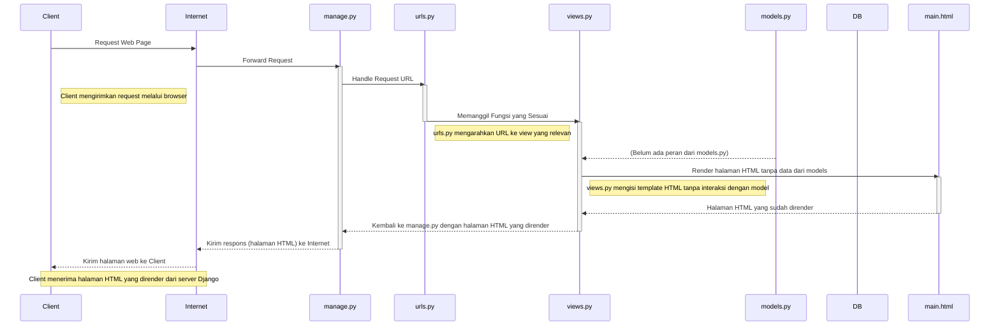

## Gilbert Kristian - 2306274951 - PBP D (TUGAS 2)

:link: [Click Me - Link PWS](https://gilbert-kristian-newwearwise.pbp.cs.ui.ac.id/)


 - Jelaskan bagaimana cara kamu mengimplementasikan checklist di atas secara step-by-step (bukan hanya sekadar mengikuti tutorial).
    
    JAWAB : 
    
    Langkah-langkah yang saya lakukan dalam implementasi checklist adalah sebagai berikut:
    
1. Membuat sebuah repository lokal dengan nama project "Wearwise"

2. Menjalankan "django-admin startproject wear_wise ." untuk memulai project

3. Menambahkan "localhost", "127.0.0.1" ke dalam list ALLOWED_HOSTS di file settings.py untuk keperluan deployment

   ```python
   ALLOWED_HOSTS = ["localhost", "127.0.0.1", ]
   ``` 
4. Membuat aplikasi baru dengan nama main dengan menjalankan command "python manage.py startapp main"

5. Mendaftarkan 'main' ke dalam INSTALLED_APPS di settings.py pada direktori wear_wise
   ```python
   INSTALLED_APPS = [
   'django.contrib.admin',
   'django.contrib.auth',
   'django.contrib.contenttypes',
   'django.contrib.sessions',
   'django.contrib.messages',
   'django.contrib.staticfiles',
   'main'
   ]
   ``` 
6. Membuat direktori baru di dalam direktori main bernama templates untuk membuat main.html

7. Membuat model pada aplikasi main dengan nama product yang memiliki atribut name, price, description, dan quantity.

   ```python
   from django.db import models

   class Product(models.Model):
   name = models.CharField(max_length=100)
   price = models.IntegerField()
   description = models.TextField()
   quantity = models.IntegerField(default=0)

   @property
   def __str__(self):
      return self.name
   ``` 
8. Membuat migrasi model dengan menjalankan "python manage.py makemigrations" & "python manage.py migrate" untuk menyesuaikan struktur tabel database 
berdasarkan perubahan model yang telah ditentukan dalam kode.

9. Menghubungkan views.py pada direktori main dengan template, fungsi ini akan mengatur permintaan HTTP dan mengembalikan 
nama aplikasi, nama, dan kelas.
   ```python
   from django.db import models

   class Product(models.Model):
   name = models.CharField(max_length=100)
   price = models.IntegerField()
   description = models.TextField()
   quantity = models.IntegerField(default=0)

   @property
   def __str__(self):
      return self.name
   ``` 

10. Membuat _routing_ dengan membuat file urls.py di aplikasi main untuk memetakan fungsi yang telah dibuat di views.py 
dengan membuat urlpatterns = [path('', show_main, name='show_main'),]
      ```python
      from django.urls import path
      from main.views import show_main

      app_name = 'main'

      urlpatterns = [
         path('', show_main, name='show_main'),
      ]
      ```

11. Membuat _routing_ di file urls.py di direktori wear_wise dengan membuat urlpatterns = [path('', include('main.urls')),] 
yang akan mengimpor rute URL dari aplikasi.
      ```python
      from django.contrib import admin
      from django.urls import path, include 

      urlpatterns = [
         path('admin/', admin.site.urls),
         path('', include('main.urls')),
      ]
      ```

12. Men-deploy ke PWS agar dapat diakses _public_, lalu meletakkan URL PWS ke ALLOWED_HOSTS di settings.py
      ```python
      ALLOWED_HOSTS = ["localhost", "127.0.0.1", "gilbert-kristian-newwearwise.pbp.cs.ui.ac.id"]
      ```

 - Buatlah bagan yang berisi request client ke web aplikasi berbasis Django beserta responnya dan jelaskan pada bagan tersebut kaitan antara urls.py, views.py, models.py, dan berkas html.
    
    Jawab :



   Penjelasan alur bagan :
   1. Client meminta halaman web, kemudian permintaan ini diteruskan oleh Internet ke server Django, yaitu manage.py.
   2. manage.py menerima permintaan dan meneruskannya ke urls.py, yang bertugas memetakan URL yang diminta ke fungsi yang sesuai di views.py.
   3. urls.py mengarahkan permintaan ke fungsi yang relevan di views.py. Di sini, views.py dapat meminta data dari models.py jika diperlukan.
   4. views.py merender halaman HTML dengan mengisi template yang relevan (diwakili oleh main.html).
   5. main.html mengembalikan halaman yang telah dirender ke views.py, yang kemudian mengirimkan hasilnya ke manage.py.
   6. manage.py mengirimkan respons halaman HTML yang dirender kembali ke Client melalui Internet, yang akhirnya memungkinkan Client untuk menampilkan halaman web di browser.


- Jelaskan fungsi git dalam pengembangan perangkat lunak!
    
    Jawab : 
    
   Git dapat membantu dalam pengembangan perangkat lunak yang memungkinkan banyak pengembang untuk bekerja sama dan dapat mudah untuk melacak perubahan dalam kode. Fitur yang paling berguna dalam pengembangan perangkat lunak di git adalah branch. Dengan menyediakan mekanisme branch, Git memudahkan kolaborasi antarpengembang sehingga banyak orang dapat bekerja pada fitur yang berbeda secara bersamaan tanpa terjadi konflik. Pengembang bisa membuat branch baru untuk setiap fitur atau bug fix dan menggabungkannya setelah selesai.

   Beberapa manfaat lain git dalam pengembangan perangkat lunak:
   1. Versi Kontrol: Git membantu tim pengembang memantau perubahan kode sumber. Setiap perubahan yang dilakukan pada proyek disimpan dalam commit sehingga memungkinkan para pengembang melihat riwayat perubahan dan memulihkan versi sebelumnya jika terjadi masalah.

   2. Pemulihan Kesalahan: Git menyimpan semua aktivitas proyek sehingga mudah untuk menemukan dan memperbaiki kesalahan tanpa kehilangan pekerjaan penting dan memungkinkan pengembang untuk memutar kembali proyek ke versi sebelumnya jika terjadi bug atau kesalahan.

   3. Penyimpanan Terdistribusi: Git menggunakan pendekatan terdistribusi yang memungkinkan setiap pengembang memiliki salinan lengkap dari riwayat proyek secara keseluruhan dan juga pengembang dapat melanjutkan pekerjaan secara lokal tanpa koneksi internet, serta bisa mensinkronisasi perubahan ke server pusat kapanpun diperlukan.

   4. Integrasi Berkelanjutan (CI/CD): Git sering digunakan dengan alat integrasi berkelanjutan (CI) dan pengiriman berkelanjutan (CD) untuk menguji dan mengirimkan kode secara otomatis setiap kali perubahan di-push yang akan mempercepat siklus pengembangan dan membantu menemukan kesalahan lebih awal.

   5. Open Source : Git adalah tools open-source yang populer di banyak proyek perangkat lunak, termasuk proyek open-source besar. Platform seperti GitHub akan mempermudah pengembang dari seluruh dunia untuk berkontribusi pada proyek.

- Menurut Anda, dari semua framework yang ada, mengapa framework Django dijadikan permulaan pembelajaran pengembangan perangkat lunak?
    
    Jawab :  

    Django dijadikan permulaan pembelajaran pengembangan perangkat lunak karena pengembangannya yang bersifat open source, ridiculously fast, fully loaded, reassuringly secure, exceedingly scalable, dan incredibly versatile. Django menyediakan banyak fitur-fitur bawaan yang memudahkan pemula untuk mulai membangun aplikasi. Django juga menggunakan pola MTV yang membantu pemula lebih mudah dalam memahami struktur aplikasi, yaitu model (database), view (logika aplikasi), dan template (mengelola tampilan). Django juga menggunakan Python, yang jugdi mana merupakan bahasa pemrograman yang populer di kalangan pemula karena sintaksnya yang sederhana dan mudah dibaca. Django juga dirancang dengan mempertimbangkan praktik keamanan yang baik.

- Mengapa model pada Django disebut sebagai ORM?
    
    Jawab :

    Django disebut sebagai Object Relational Mapping karena penggunaan ORM di Django memungkinkan pengembang untuk berinteraksi dengan database menggunakan kode Python tanpa menulis SQL secara manual. Django akan mengubah objek Python (model) menjadi tabel di database. Setiap atribut model diubah menjadi kolom dalam tabel. 


